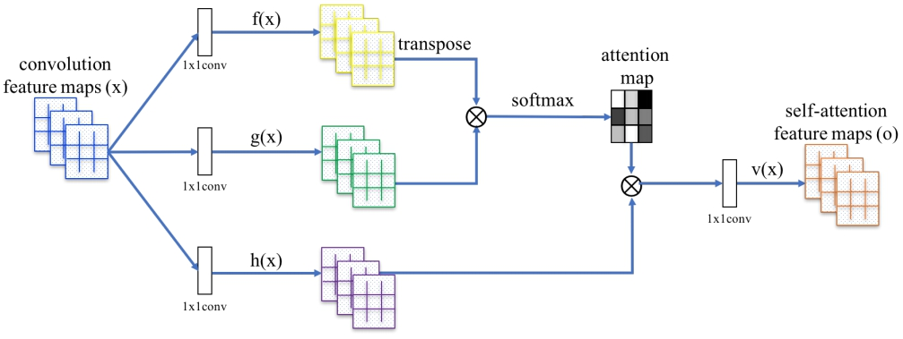

"# Self-Attention Generative Adversarial Networks" 

  [Paper](https://arxiv.org/pdf/1805.08318.pdf)

The tensorFlow implementation of Self-Attention Generative Adversarial Networks in the paper by Han Zhang, Ian Goodfellow, Dimitris Metaxas and Augustus Odena.

## Setup
- Tensorflow 1.6.0
- Python 3.6.4

### Device
- NVIDIA 1050TI 4G

### Dataset
 This test used 17000 dog images from kaggle competition about [dog generative](https://www.kaggle.com/c/generative-dog-images/overview).
### Parameter
- Iteration 100000
- G Learning rate 0.0001
- D Learning rate 0.0004

### Summary
This test is desined to generate 64 x 64 images instead of 128 x 128 in original SAGAN models.



- Code
``` bash
def self_attention(x, update_collection = None, scope = 'attention'):
     with tf.variable_scope(scope):
          batch_size, height, width, num_channels = x.get_shape().as_list()
 
          g = conv(x, num_channels // 8, kernel = 1, update_collection = update_collection, scope = 'g_conv')
          g =  tf.reshape(g, [g.shape[0], -1, g.shape[-1]])

          f = conv(x, num_channels // 8, kernel = 1, update_collection = update_collection, scope = 'f_conv')
          f = tf.layers.max_pooling2d(f, pool_size = 2, strides = 2)
          f =  tf.reshape(f, [f.shape[0], -1, f.shape[-1]])

          attn_map = tf.matmul(g, f, transpose_b = True)
          attn_map = tf.nn.softmax(attn_map)

          h = conv(x, num_channels // 2, kernel = 1, update_collection = update_collection, scope = 'h_conv')
          h = tf.layers.max_pooling2d(h, pool_size = 2, strides = 2)
          h =  tf.reshape(h, [h.shape[0], -1, h.shape[-1]])

          sigma  = tf.get_variable("sigma", [], initializer = tf.constant_initializer(0.0))

          o = tf.matmul(attn_map, h)
          o = tf.reshape(o, shape=[batch_size, height, width, num_channels // 2])
          o = conv(o, num_channels, kernel = 1, update_collection = update_collection, scope='attn_conv')
          
          return sigma * o + x
``` 

### Train 
You need to put the dataset in the ```./dataset```, and result will save in the ```./images``` after training.
```bash
python main.py
``` 


